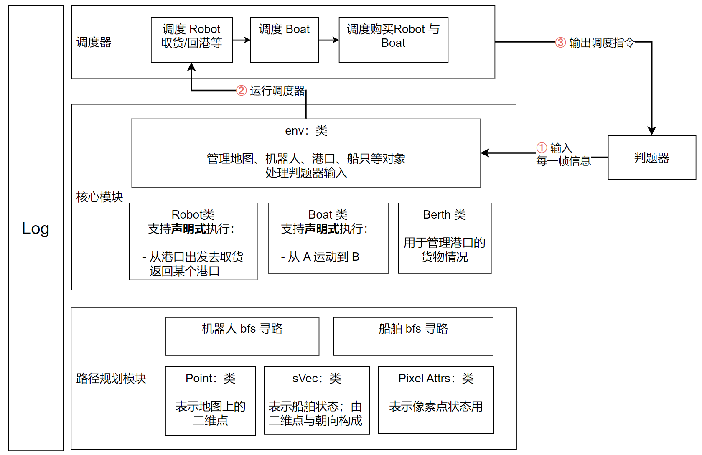
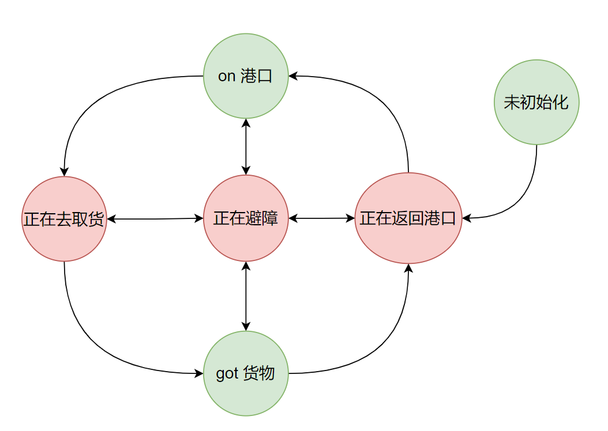
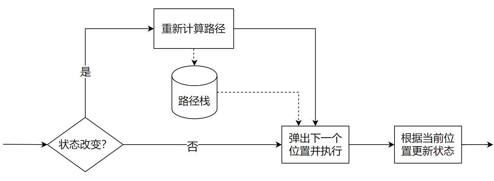
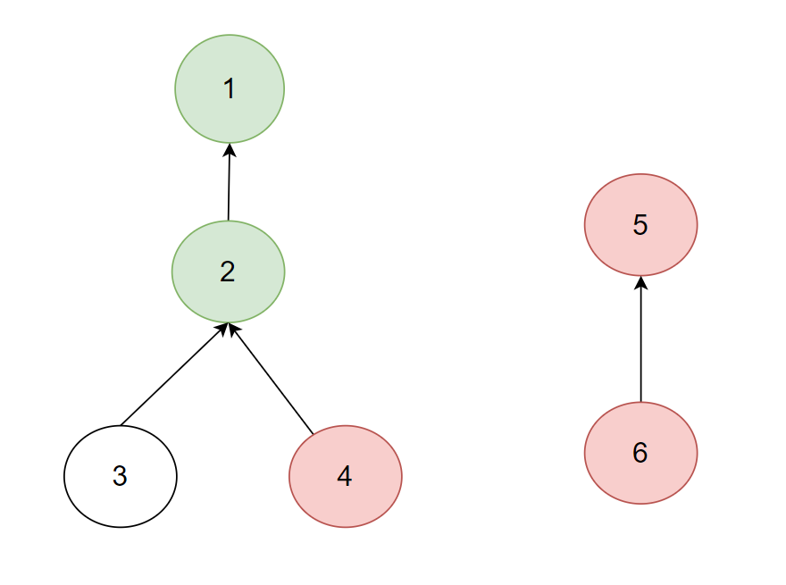
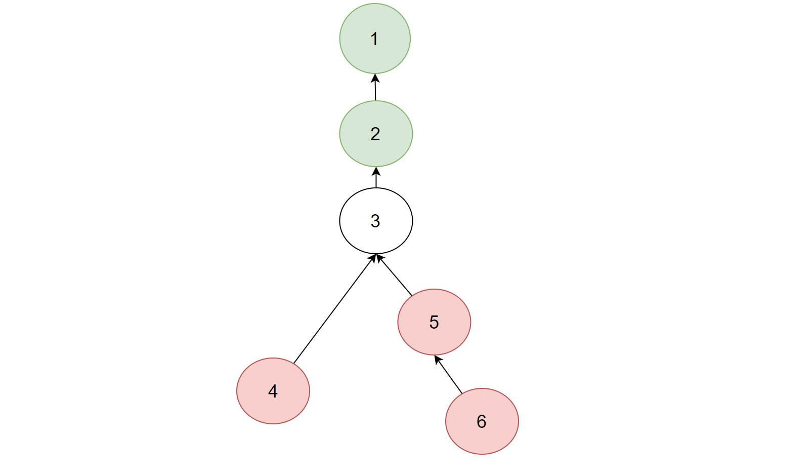

## 比赛背景

在智能港口领域，如何规划多机器人的任务执行以实现最优调度，如何控制泊位和机器人的配合实现最高运输价值等都是非常有价值的算法难题。本次比赛通过软件模拟了智能港口的状态信息，由选手来挑战这些有价值的算法难题。

## 效果展示
[展示视频网页地址：https://jiiiong.github.io/24-Huawei-Planck-official/](https://jiiiong.github.io/24-Huawei-Planck-official/)

## 如何运行

环境要求：
- python 3.7
- ubuntu 18.04
（其他环境配置未测试，更高版本一般可行）

运行命令：
```
git clone https://github.com/jiiiong/24-Huawei-Planck-official.git
cd 24-Huawei-Planck-official

# 该命令会启动判题器，根据 solution/main.py 控制机器人和船舶在 map 上运动；
# 最终运行结果保存在 /replay 下
./run_simple_demo.sh
```

回放结果：使用 /replayer 中的播放器可以播放 /replay 下的回放文件，播放器有 windows 和 linux 两个版本

## 解决方案架构设计

路径规划模块：负责提供描述地图所需的数据结构

核心模块：
- 负责提供具备执行**声明式命令**能力的建模对象，例如 Robot 类对应的实例，声明式命令只需告诉他去某个点 A，他会自动控制到达A，而不需要在每一帧控制 Robot 的运动；他**通过向调度器提供声明式命令接口的方式，极大的减轻了调度者使用 Robot 的负担；并且使得 Robot 可以轻松更换内部的实现方法；**
- env：
	- 负责管理运行期间所有的上下文，包括地图、机器人组、船舶组、港口组等等
	- 负责处理判题器输入

 调度器：调度器拥有 env 实例，即其拥有调度所需的所有信息；此处使用调度算法，声明式地命令机器人、船舶来进行取货、返港、装货、运输等等；


Log 模块：负责记录运行过程中产生的数据，用于 debug 和 优化调度算法

## 声明式 Robot 实现

基于状态机的思想实现，状态转换图如下：

### **声明式命令**
外部系统可以**通过 api 在合适的时机对状态进行切换**。此处何时的时机一般是指 robot *未初始化*、*on 港口*或者*取到货物*，即图中绿色的状态；

例如在 robot 处于港口时，命令其去某个位置取货，此时 robot 会切换到 *正在去取货* 状态，直到其取到货之前他不会切换到 *got货物*状态；

值得注意的是，机器人去取货的操作是内部逻辑处理的，不需要外部调用者关心，即**声明式**；外部调用者只需要关心货物是否已经被取到，即 robot 的状态是否切换到了 got货物。

### 实现原理
机器人会维护一个栈，里面保存了前往目标点需要经过的位置。每一帧，如果机器人状态改变，则重新计算路径；同时每一帧会弹出栈顶，并移动到弹出的位置

### 多机器人碰撞避免算法
简单来说就是每个机器人在每一帧检测是否会在下一帧发生碰撞，如果会，则进入避障状态，在避障状态中尝试找到不会发生碰撞的路径；实际上，实现鲁棒性较高的避障还需要回答几个问题
1. 谁避让谁：我通过给予不同状态不同的优先级来规定避障优先级；低优先级的机器人负责避让高优先级的机器人
2. 避让路径如何决定：我的主要策略是让处于避障状态的机器人寻找路径避开其负责（需要避障）的机器人
3. 如何避免多个机器人互相避让形成环；**为了解决成环问题，我们将机器人之间的避让关系以树的形式维护，并在进行新的避让时避免在树种形成环**。具体来说，子节点（处于避让状态的机器人）会让周围所有不是他祖先的节点（它负责避让的机器人）对他自己进行避让；

    例如下图中：

③ 负责避让 ② 和 ①；如果他在避让 ① 和 ② 的过程中碰见 ④，⑤，⑥ 中的任意一个节点，③ 会让他们进入避障状态；假设 ③ 分别需要让 ④ 和 ⑤ 进行避让，则他们会变成如下树状关系：
